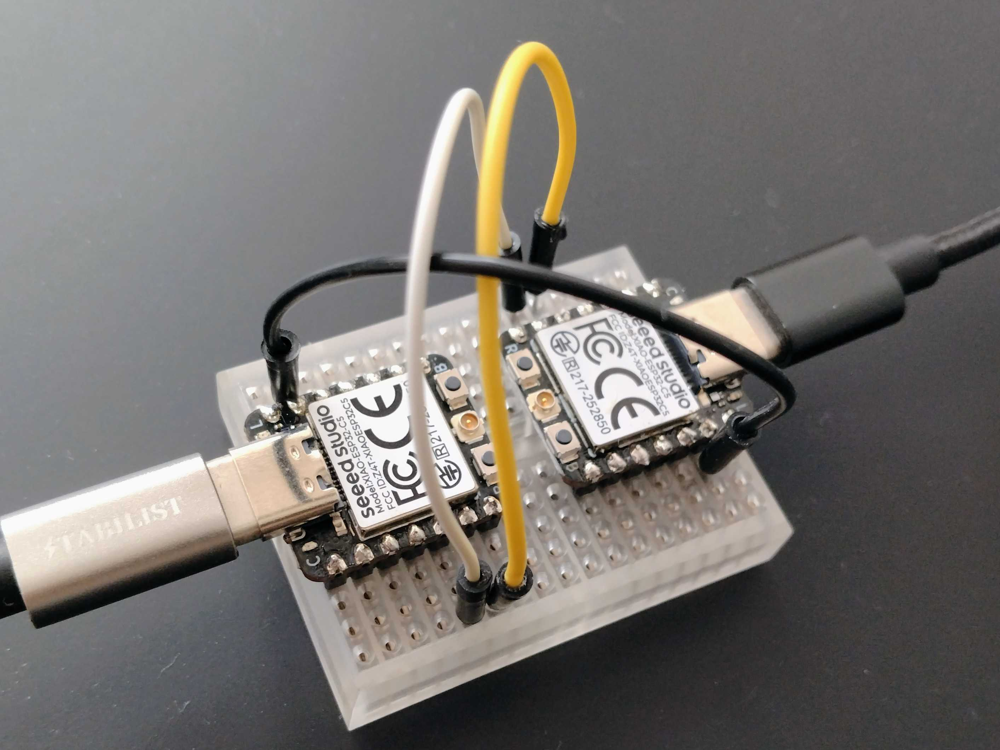

<!--
SPDX-FileCopyrightText: 2026 piyopiyo.ex members

SPDX-License-Identifier: Apache-2.0
-->

# ESP32 で serial distributed Erlang

2 台の AtomVM 対応 ESP32 ボードを 3 本のジャンパーワイヤーで直結し、ノード間で `ping` / `pong` を送るサンプルです。

既定の UART pin は、動作確認に使っている Seeed Studio XIAO ESP32-C5 に合わせています。他の ESP32 variant や開発ボードでも、使用する UART GPIO を build 時に指定できます。

最初のゴールはこれだけです。

```text
PC
├── USB ポート 1 ─── USB ケーブル ─── Board A（a@serial.local）
└── USB ポート 2 ─── USB ケーブル ─── Board B（b@serial.local）

Board A                              Board B
D4 / GPIO23（UART1 TX） ───────────> D5 / GPIO24（UART1 RX）
D5 / GPIO24（UART1 RX） <─────────── D4 / GPIO23（UART1 TX）
GND                     ──────────── GND
```

このサンプルは、XIAO ESP32-C5 の GPIO matrix を使って `UART1` の TX を `D4 / GPIO23`、RX を `D5 / GPIO24` へ割り当てます。2 本の USB ケーブルは、同じ PC の別々の USB port へ接続します。



写真は動作確認時の配線です。ワイヤーの色ではなく、下の表にある pin 名を見て接続してください。

XIAO ESP32-C5 の `D6 / GPIO11` と `D7 / GPIO12` には、それぞれ `TX` / `RX` と表示されています。これらは ESP32-C5 の標準的な `UART0` の pin ですが、公式 AtomVM firmware では `UART0` が console 出力に使われています。

そのため、このサンプルでは `D6 / D7` を `serial_dist` 用には使用しません。console と競合しないように、別の `UART1` を使い、TX/RX を `D4 / GPIO23` と `D5 / GPIO24` に割り当てています。

```text
D6 / GPIO11 (TX) ─┐
D7 / GPIO12 (RX) ─┴─ UART0 → AtomVM console 用

D4 / GPIO23       ── UART1 TX → serial_dist 用
D5 / GPIO24       ── UART1 RX → serial_dist 用
```

つまり、基板上の `TX` / `RX` 表示が間違っているわけではなく、**AtomVM がその UART を console に使用しているため、serial_dist では別の pin を使う**という構成です。

重要なルールは 3 つです。

1. `TX` は相手の `RX` へ接続する。`TX` 同士は接続しない
2. 2 台の `GND` を接続する
3. `3V3`、`5V`、`VBUS`、`VIN` などの電源 pin は 2 台の間で接続しない。各ボードは自分の USB ケーブルから給電する

> XIAO ESP32-C5 なら UART pin の設定は不要です。それ以外のボードでは、配線前に手順 3 の「他の ESP32 ボード」を確認してください。

## 用意するもの

- AtomVM が対応する ESP32 開発ボード × 2（同じモデル 2 台が分かりやすい）
- 各ボードの USB コネクターに合うデータ通信対応ケーブル × 2
- ボードの pin header に合うジャンパーワイヤー × 3
- macOS または Linux の PC
- Erlang/OTP 27、Elixir 1.17、`mix`

2 台を区別できるように、テープなどで片方に `A`、もう片方に `B` と書いておくと作業が楽です。

## 1. 依存関係を取得する

このリポジトリのディレクトリで実行します。

```sh
mix deps.get
```

## 2. AtomVM を 2 台にインストールする

この作業では、間違ったボードを選ばないように 1 台ずつ USB 接続します。ジャンパーワイヤーはまだ接続しません。

まず Board A だけを PC に接続します。

```sh
mix atomvm.esp32.install --version v0.7.0-beta.0
```

表示された chip が接続したボードの ESP32 variant と一致することを確認してから続行します。XIAO ESP32-C5 では `esp32c5` と表示されます。この操作はボードの flash を消去します。

完了したら Board A を外し、Board B だけを接続して同じコマンドをもう一度実行します。

ダウンロードした AtomVM image は `firmware_images/` にキャッシュされます。リポジトリには firmware image を保存しません。

## 3. UART pin を決めて 3 本のワイヤーを接続する

両方の USB ケーブルを外してから配線します。

### 既定: XIAO ESP32-C5

XIAO ESP32-C5 では追加設定なしで次の pin を使います。表の `UART1 TX` / `UART1 RX` は、このアプリが GPIO matrix で割り当てる役割であり、基板上の印字ではありません。

| ワイヤー | Board A                     | Board B                     |
| -------- | --------------------------- | --------------------------- |
| 1        | `D4` / `GPIO23`（UART1 TX） | `D5` / `GPIO24`（UART1 RX） |
| 2        | `D5` / `GPIO24`（UART1 RX） | `D4` / `GPIO23`（UART1 TX） |
| 3        | `GND`                       | `GND`                       |

`D4` / `D5` は基板上では `SDA` / `SCL` と表示されています。このサンプルの実行中は I2C ではなく UART1 の TX / RX として使用するため、同じ pin に I2C device を接続しません。

#### なぜ基板の TX / RX pin を使わないのか

| pin           | 公式 pinout の役割           | この構成での状態                                  |
| ------------- | ---------------------------- | ------------------------------------------------- |
| `D6 / GPIO11` | TX、ESP32-C5 の既定 UART0 TX | AtomVM firmware の console が使用                 |
| `D7 / GPIO12` | RX、ESP32-C5 の既定 UART0 RX | AtomVM firmware の console が使用                 |
| `D4 / GPIO23` | SDA                          | GPIO matrix で serial_dist 用 UART1 TX に割り当て |
| `D5 / GPIO24` | SCL                          | GPIO matrix で serial_dist 用 UART1 RX に割り当て |

ESP32-C5 では UART signal を GPIO matrix 経由で利用可能な GPIO へ割り当てられます。したがって、基板上の `TX` / `RX` 印字は唯一の UART pin という意味ではありません。AtomVM firmware を独自 build して console を UART0 から外せば D6 / D7 を利用できる可能性はありますが、このリポジトリは公式 `v0.7.0-beta.0` image を前提に、実機確認済みの D4 / D5 を既定値とします。

### 他の ESP32 ボード

使用するボードの pinout と firmware の console 設定を確認し、console や他の peripheral が使用していない TX GPIO と RX GPIO を 1 つずつ選びます。次は書式の例です。`17` と `16` が自分のボードで利用できることを確認し、必要なら正しい GPIO 番号へ置き換えてください。

```sh
export ATOMVM_UART_TX_PIN=17
export ATOMVM_UART_RX_PIN=16
export ATOMVM_UART_SPEED=115200
export ATOMVM_UART_PERIPHERAL=UART1
```

この設定は Board A と Board B の両方を書き込むまで同じ shell に残しておきます。配線はボード名や GPIO 番号に関係なく次の 3 本です。

| ワイヤー | Board A            | Board B            |
| -------- | ------------------ | ------------------ |
| 1        | 設定した `TX` GPIO | 設定した `RX` GPIO |
| 2        | 設定した `RX` GPIO | 設定した `TX` GPIO |
| 3        | `GND`              | `GND`              |

配線後、次のチェックを 1 行ずつ確認します。

- [ ] A の TX GPIO は B の RX GPIO に接続されている
- [ ] A の RX GPIO は B の TX GPIO に接続されている
- [ ] A の `GND` は B の `GND` に接続されている
- [ ] `3V3`、`5V`、`VBUS`、`VIN` などの電源 pin には何も接続していない
- [ ] ワイヤーを挿したまま無理な力が USB コネクターにかかっていない

このサンプルでは RS485 transceiver や抵抗は使いません。2 台の 3.3 V UART を直接接続します。

## 4. USB port を確認する

配線はそのままで、まず Board A の USB だけを PC に接続します。

```sh
mix atomvm.esp32.info
```

表示された port を Board A 用として記録します。例: `/dev/ttyACM0`

次に Board B の USB も接続し、もう一度確認します。

```sh
mix atomvm.esp32.info
```

新しく増えた port が Board B です。例: `/dev/ttyACM1`

macOS では `/dev/cu.usbmodemXXXX` のような名前になります。以下のコマンドに出てくる port 名は、自分の環境の値へ置き換えてください。

## 5. Board A にアプリを書き込む

Board A は `a@serial.local` として起動し、相手からの `ping` を待ちます。

```sh
export ATOMVM_NODE_ALIAS=a
export ATOMVM_PEER_ALIAS=b
unset ATOMVM_AUTO_PING

mix clean
mix atomvm.esp32.flash --port /dev/ttyACM0
```

`/dev/ttyACM0` は、手順 4 で記録した Board A の port に置き換えます。

## 6. Board B にアプリを書き込む

Board B は `b@serial.local` として起動し、起動後に Board A へ `ping` を 1 回送ります。

```sh
export ATOMVM_NODE_ALIAS=b
export ATOMVM_PEER_ALIAS=a
export ATOMVM_AUTO_PING=true

mix clean
mix atomvm.esp32.flash --port /dev/ttyACM1
```

`/dev/ttyACM1` は Board B の port に置き換えます。

`mix clean` は省略しないでください。ノード名などの環境変数は build 時にアプリへ埋め込まれるためです。

## 7. ログを確認する

端末を 2 つ開きます。

端末 1 で Board A:

```sh
mix atomvm.esp32.monitor --port /dev/ttyACM0
```

端末 2 で Board B:

```sh
mix atomvm.esp32.monitor --port /dev/ttyACM1
```

Board A の UART 設定が表示されます。XIAO ESP32-C5 の既定値では次のようになります。

```text
serial_dist: alias a
serial_dist: node :"a@serial.local"
serial_dist: peer :"b@serial.local"
serial_dist: uart [{:peripheral, "UART1"}, {:speed, 115200}, {:tx, 23}, {:rx, 24}]
serial_dist: ready
demo: registered process :demo
```

成功すると、Board B に `received pong` が表示されます。

```text
demo: sending ping to :"a@serial.local"
demo: received pong from :"a@serial.local"
```

同時に Board A には次のログが表示されます。

```text
demo: received ping from :"b@serial.local"
demo: sent pong from :"a@serial.local"
```

ここまで表示されれば成功です。

## うまくいかないとき

### 両方に `serial_dist: ready` は出るが `pong` が返らない

5 秒後に次の表示が出ます。

```text
demo: pong timeout from :"a@serial.local"
```

これは ping を送ったが、相手から pong が戻らなかったという意味です。

電源を切って、3 本のワイヤーを確認します。最も多い間違いは `TX` と `TX`、`RX` と `RX` を接続することです。

```text
A TX  -> B RX
A RX  <- B TX
A GND -- B GND
```

起動ログの `:tx` と `:rx` が、実際に配線した GPIO 番号と一致することも確認してください。

XIAO ESP32-C5 で D6 / GPIO11 と D7 / GPIO12 に接続している場合は、公式 AtomVM firmware の UART0 console と競合します。信号線を D4 / GPIO23 と D5 / GPIO24 へ移動してください。

### 両方が同じノード名で起動する

Board A と Board B の書き込み前に、それぞれ正しい環境変数を設定して `mix clean` したか確認します。

### USB port が見つからない

- USB ケーブルが充電専用ではなく、データ通信対応か確認する
- 1 台ずつ接続して `mix atomvm.esp32.info` を実行する
- 別の monitor や serial terminal が同じ port を開いていないか確認する

### 起動しない、または不安定

- 2 台の間に `3V3`、`5V`、`VBUS`、`VIN` などの電源 pin を接続していないか確認する
- ジャンパーワイヤーを短くする
- USB hub を外し、PC の USB port へ直接接続してみる

## UART の既定値と変更方法

リポジトリの既定値は XIAO ESP32-C5 用です。

| 項目                  | 既定値                            |
| --------------------- | --------------------------------- |
| peripheral            | `UART1`                           |
| speed                 | `115200`                          |
| UART1 TX の割り当て先 | `D4` / `GPIO23`（基板表示は SDA） |
| UART1 RX の割り当て先 | `D5` / `GPIO24`（基板表示は SCL） |

ノードごとの設定:

| 環境変数                 | 既定値                           | 説明                                       |
| ------------------------ | -------------------------------- | ------------------------------------------ |
| `ATOMVM_NODE_ALIAS`      | `a`                              | 自ノードの alias                           |
| `ATOMVM_PEER_ALIAS`      | `b`、自ノードが `a` 以外なら `a` | 相手ノードの alias                         |
| `ATOMVM_COOKIE`          | `AtomVM`                         | 両ノードで同じ値にする distribution cookie |
| `ATOMVM_AUTO_PING`       | false                            | `true` なら起動後に 1 回 ping              |
| `ATOMVM_PING_DELAY_MS`   | `1000`                           | ping までの待ち時間                        |
| `ATOMVM_PONG_TIMEOUT_MS` | `5000`                           | pong を待つ時間。超えると timeout を表示   |

他のボードでは手順 3 の環境変数で上書きします。値を変えた後は必ず `mix clean` してください。2 台には同じ UART 設定を使用し、配線は常に TX → RX、RX ← TX、GND ↔ GND とします。

環境変数を指定したのに値が整数でない、範囲外である、node alias に `@` や空白が含まれる、といった場合は build を中止してエラーを表示します。誤った既定値のまま board へ書き込むことはありません。

> Distribution cookie はノード同士を認証するための共通の秘密です。ログや公開資料に実際の値を載せないでください。また、cookie は通信を暗号化しません。このサンプルは手元で直結した 2 台の board を前提にしています。

## 開発時の確認

```sh
mix format --check-formatted
mix test
mix atomvm.packbeam
```

このサンプルは AtomVM `v0.7.0-beta.0` の serial distribution を対象にしています。`mix atomvm.packbeam` は、対応する `atomvm` API metadata package がない場合に警告を表示します。

## 関連資料

- [AtomVM release-0.7: Distributed Erlang](https://doc.atomvm.org/release-0.7/distributed-erlang.html)
- [ExAtomVM](https://github.com/atomvm/exatomvm)
- [Seeed Studio XIAO ESP32-C5 pin map](https://wiki.seeedstudio.com/xiao_esp32c5_getting_started/#pin-map)
- [Espressif ESP32-C5 hardware design guidelines: UART](https://docs.espressif.com/projects/esp-hardware-design-guidelines/en/latest/esp32c5/schematic-checklist.html#uart)
- [設計判断記録](docs/adr/README.md)
